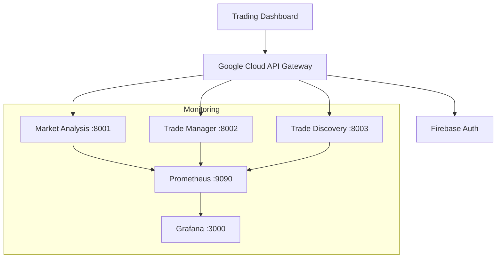

# Minimal Cost Architecture for Personal Trading System

## Overview
This document outlines the architecture for a cost-effective personal trading system, optimized for single-user operation while maintaining security and reliability.

## System Components

### 1. Authentication (Firebase)
- **Tier**: Spark Plan (Free)
- **Limits**: 
  - 10k authentications/month
  - Unlimited users
- **Features Used**:
  - Email/password authentication
  - JWT token management
  - Security rules

### 2. API Gateway (Google Cloud)
- **Tier**: Free tier
- **Limits**:
  - 2 million calls/month
- **Features Used**:
  - Route management
  - Firebase Auth integration
  - Basic security policies

### 3. Service Discovery
- **Implementation**: Simple DNS + Health Checks
- **Cost**: $0 (built into application)
- **Components**:
  - Health check endpoints
  - Service registry in application config
  - Basic retry logic

### 4. Monitoring Stack
- **Implementation**: Self-hosted Prometheus + Grafana OSS
- **Cost**: $0 (runs on existing infrastructure)
- **Components**:
  - Prometheus server
  - Grafana dashboards
  - Basic alerting
  - 15-day metrics retention

### 5. Container Management
- **Implementation**: Docker + docker-compose
- **Cost**: $0
- **Components**:
  - Local Docker runtime
  - Compose for service orchestration
  - Volume management for persistence

## Service Architecture

## Port Assignments
- Trading Dashboard: 8000 (primary)
- Market Analysis: 8001
- Trade Manager: 8002
- Trade Discovery: 8003
- Prometheus: 9090
- Grafana: 3000

## Cost Management

### Monthly Estimates
- Firebase: $0 (Free tier)
- Google Cloud API Gateway: $0-5
- Infrastructure: $0 (local hosting)
- Total: $0-5/month

### Usage Monitoring
- Firebase Console for auth metrics
- Google Cloud Console for API usage
- Grafana dashboards for system metrics

## Scaling Considerations

### When to Scale Up
1. API calls approach 2M/month
2. Authentication needs exceed 10k/month
3. Performance degradation observed

### Upgrade Path
1. Move to paid Firebase plan
2. Consider managed API Gateway
3. Evaluate cloud hosting options

## Security Measures

### Authentication
- Firebase Authentication
- JWT token validation
- HTTPS everywhere

### API Security
- Rate limiting per user
- Input validation
- Error handling

### Monitoring
- Basic security metrics
- Authentication logs
- API access logs

## Development Guidelines

### Local Setup
1. Install Docker and docker-compose
2. Configure Firebase credentials
3. Set up Google Cloud API Gateway
4. Initialize monitoring stack

### Deployment
1. Configure production environment
2. Set up SSL certificates
3. Initialize monitoring
4. Deploy services

### Testing
1. Unit tests
2. Integration tests
3. Load testing (basic)

## Maintenance

### Daily Operations
- Monitor system health
- Check error logs
- Verify service status

### Weekly Tasks
- Review metrics
- Backup critical data
- Update dependencies

### Monthly Tasks
- Review usage metrics
- Check for security updates
- Optimize configurations
